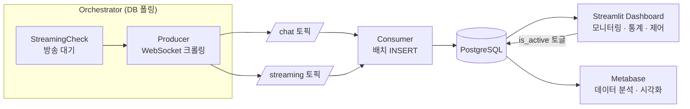

# Chzzk-Data-Analytics

Chzzk(치지직) 스트리밍 플랫폼의 채팅·후원 데이터를 실시간 수집하고 분석하는 데이터 파이프라인입니다.

- 방송 채팅, 도네이션, 구독 데이터를 실시간 수집
- 과거 데이터 분석(Analysis)을 넘어 예측 등의 Analytics를 목표
- LLM + RAG를 활용한 자연어 질의 기반 분석까지 확장 예정

## 아키텍처



### 핵심 모듈

| 모듈 | 역할 |
|---|---|
| `orchestrator.py` | DB `is_active` 플래그 폴링 → 크롤러 스레드 자동 관리 |
| `components/producer.py` | WebSocket 채팅 크롤링 → Kafka 발행 |
| `components/consumer.py` | Kafka 소비 → `execute_values` 배치 INSERT |
| `components/streaming_check.py` | 방송 상태 API 폴링 (시작 대기) |
| `components/keyword_analyzer.py` | 키워드 배치 분석 (kiwipiepy 형태소 분석) |
| `modules/chzzk/` | Chzzk API 클라이언트, WebSocket 핸들러, 이모지 관리 |
| `modules/kafka/` | Kafka producer/consumer 래퍼 |
| `modules/postgresql/` | DB 연결 헬퍼 + 스키마 정의 |
| `dashboard/` | Streamlit 대시보드 (스트리머 제어, 통계, DB 조회, Kafka 모니터링) |

### 데이터 무결성

- **결정적 msg_id**: `SHA256(cid:uid:msg:msgTime:idx)` → 동일 메시지는 항상 같은 ID
- **DB 중복 방지**: `ON CONFLICT (msg_id) DO NOTHING`
- **재연결 시 갭 최소화**: 최근 100건 메시지를 재처리하여 누락 방지
- **타임스탬프**: 치지직 서버의 `msgTime`(채팅 발생 시점)을 `ts`에 저장

## 실행 방법

### 1. 환경 설정

`.env.example`을 복사하여 `.env`를 생성합니다.

```bash
cp .env.example .env
```

```env
KAFKA_BOOTSTRAP_SERVERS=localhost:9092
POSTGRES_HOST=localhost
POSTGRES_PORT=5432
POSTGRES_DB=chzzk
POSTGRES_USER=postgres
POSTGRES_PASSWORD=postgres
NID_SES=네이버_NID_SES_쿠키
NID_AUT=네이버_NID_AUT_쿠키
```

- `NID_SES`, `NID_AUT`: 네이버 로그인 후 브라우저 개발자 도구(F12) → Application → Cookies에서 복사

### 2. Docker 실행

```bash
# 인프라 + 앱 전체 실행
docker compose -f docker/docker-compose.yaml up -d

# Kafka 토픽 생성 (최초 1회)
docker compose -f docker/docker-compose.yaml exec broker \
  kafka-topics --create --topic chat --bootstrap-server broker:29092 \
  --partitions 1 --replication-factor 1

docker compose -f docker/docker-compose.yaml exec broker \
  kafka-topics --create --topic streaming --bootstrap-server broker:29092 \
  --partitions 1 --replication-factor 1
```

### 3. 스트리머 등록 및 수집

대시보드(`http://localhost:8080`)의 스트리머 페이지에서 스트리머를 등록하고 `is_active` 토글로 수집을 제어합니다. Orchestrator가 DB를 폴링하여 크롤러를 자동 시작/중지합니다.

### 4. 로컬 개발

```bash
uv sync                            # 의존성 설치
uv run ruff check .                # 린트
uv run python orchestrator.py      # 데이터 수집 (크롤러 + Consumer)
uv run streamlit run dashboard/app.py  # 대시보드 (http://localhost:8501)
```

> `orchestrator.py`는 데이터 수집만 담당합니다. 대시보드는 별도로 실행해야 합니다.

## 대시보드

### Streamlit (`localhost:8080`)

| 탭 | 기능 |
|---|---|
| 스트리머 | 등록/삭제, 수집 ON/OFF 토글, 방송 상태 |
| 통계 | 스트리머별 메시지 유형, 분 단위 수집량 라인 차트, 도네이션 랭킹 |
| 데이터베이스 | 테이블 조회, 자동 갱신 토글 |
| Kafka | 브로커/토픽/컨슈머 그룹 상태, Lag 모니터링, 시스템 리소스 |
| 키워드 분석 | 채팅 키워드 빈도 분석, 채팅 타임라인 차트 |

### Metabase (`localhost:3000`)

Metabase를 통해 수집된 데이터에 대한 자유로운 질의와 시각화를 할 수 있습니다. 초기 설정 시 데이터 소스로 PostgreSQL(`postgres-server:5432`, DB: `chzzk`)을 추가하세요.

## 기술 스택

- Python 3.12+, uv
- Kafka (Confluent), PostgreSQL 14
- Streamlit (대시보드), Metabase (데이터 분석)
- websocket-client, kafka-python, psycopg2, kiwipiepy
- Docker Compose

## Reference

- https://github.com/Buddha7771/ChzzkChat
- https://github.com/kimcore/chzzk
